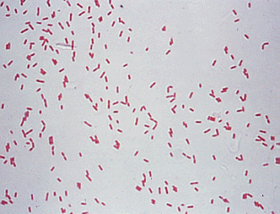

```{r setup, include=FALSE}
knitr::opts_chunk$set(echo = FALSE)
```


## About Me
- Born: November 17, 1995
- Raised in Iowa, attended Iowa State, currently a Husker
- Ph.D. Candidate in Meat Science and Muscle Biology
- Expected Graduation: Summer 2022
{width=45%}


## My Favorite Animal


My favorite animal is *Pseudomonas*. Okay, *Pseudomonas*, is not an animal, but it is the bacteria I study, so I like it more than pretty much every animal...except maybe the ones I obtain it from which would be turkeys.


## Slide with R Output

```{r cars, echo = FALSE, message=FALSE, fig.height=4}
library(magrittr)
library(mclust)
library(ggplot2)
data(banknote, package = "mclust")
data(banknote)
banknote %>% ggplot(aes(x=Top, y=Bottom, color=Status))+geom_point()
```

## CV

For more information, see <http://rmarkdown.rstudio.com>.

